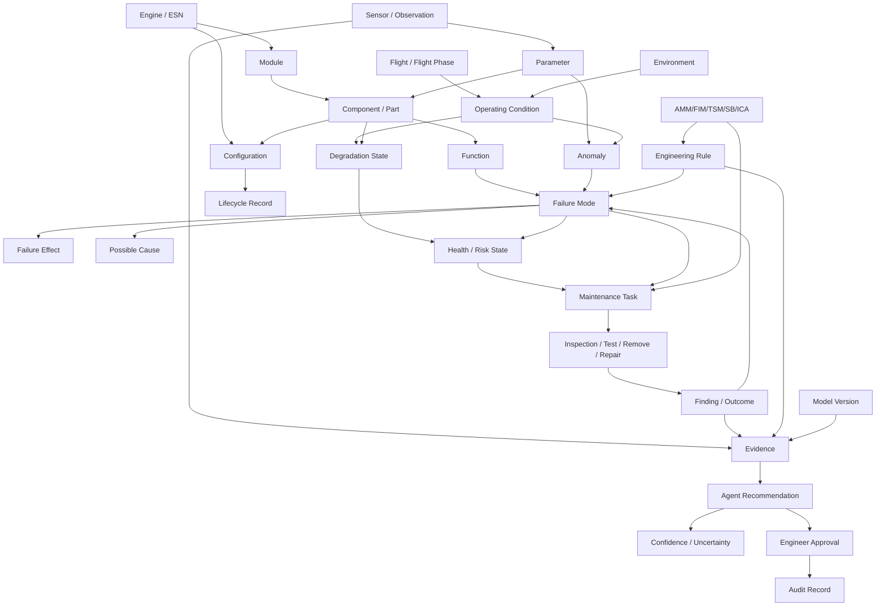
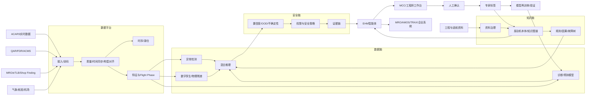
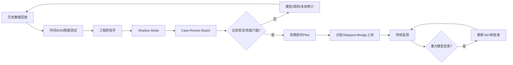
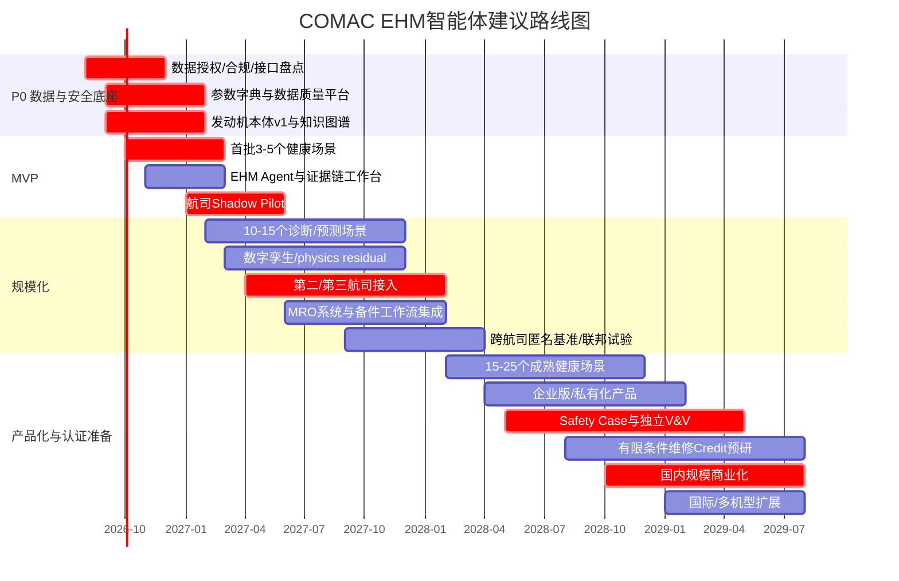

# 中国商飞“发动机健康管理（EHM）智能体”项目规划与可行性研究

## 执行摘要

中国商飞并非从零开始建设健康管理能力。中国商飞现有官方服务已经包括面向 C909、C919 的“飞机健康管理”：地面平台以 ACARS 数据为主要实时来源，并融合航后 QAR 数据，用于飞机状态与故障监控；客户接入前提之一，是授权数据链服务商把相关 ACARS 报文实时转发给中国商飞，并提供必要的报文解析规范。商飞软件近年来也已公开展示“云诊”国产民机健康管理系统、“云析”飞行数据译码平台，并在探索将 AI 用于故障预测和实时译码。citeturn9search6turn9search14turn9search15

因此，本项目最优定位不是“重新做一个 EHM 系统”，而是：

> **在“云诊/云析”之上建设一个发动机专项的、以本体和证据链为核心的智能诊断/预测/决策层，把有限的 C919/C909 运行数据、发动机工程知识、维修经验、机队环境数据与统计模型连接起来，使系统在故障样本极少时仍能产生可解释、可审计、可逐步认证的高价值判断。**

这一定位非常重要。波音 AHM、空客 Skywise、Lufthansa Technik AVIATAR 等主要是**飞机/机队级健康管理与维修决策平台**；对于 C919，真正掌握 LEAP-1C 设计知识、FADEC/发动机专有诊断逻辑和全球发动机机队经验的直接能力方，更接近 CFM/GE/Safran，而不是波音或空客。中国商飞自己的公开资料也确认 C919 使用 CFM LEAP-1C。换言之，COMAC EHM 智能体近期能够替代的主要是**数据整理、趋势监控、异常发现、故障分诊、维修资料检索、跨系统关联分析、维修建议生成和运营协同**等数字服务层；不应宣称能立即替代发动机 OEM 的设计数据、适航责任、工程限值和经批准的维护指令。citeturn9search8turn22search0turn23search0turn23search2

国际领先方案的竞争壁垒也并非单一“AI 算法”。波音将 AHM 与飞机设计知识、全球机队数据以及条件维修相结合；空客 Skywise Health Monitoring 把实时 ACARS 故障、维护信息、日志和故障排除程序连接起来；Lufthansa Technik 将飞机数据与工单等 MRO 数据联合分析；GE、Pratt & Whitney 和 Rolls-Royce 则依靠大规模发动机机队数据以及 OEM 工程专家形成更强的发动机级闭环。GE Aerospace 公开称其商业发动机装机基础约 44,000 台；Pratt & Whitney 的 ADEM 已对超过 10,000 台发动机、140 家客户提供分析；Rolls-Royce 2026 年称其 Trent EHM 每天分析约 500 万个数据点。citeturn22search5turn23search2turn23search14

这意味着，在“运行时间短、故障数据不足”的约束下，**COMAC 不应首先和上述厂商比拼大样本深度学习模型，而应改变竞争维度**：

| 战略层次 | 建议 | 原因 |
|---|---|---|
| **P0：先建立语义与证据层** | 统一发动机部件、参数、状态、故障模式、维修动作、环境、构型、适航资料的本体 | 可以在没有大量故障样本时立即产生价值，并形成长期数据资产 |
| **P0：先做诊断/预警，不先承诺精确 RUL** | 用规则、物理残差、趋势、同群比较、专家推理处理 3–5 个高价值场景 | 稀有失效导致纯监督学习最容易失败 |
| **P0：智能体仅作决策支持** | 前 18 个月不自动改变放行、MEL、维修方案或适航状态 | 大幅降低认证和安全风险；符合当前航空 AI 的人机协同方向 citeturn4search5turn5view0 |
| **P1：数据换服务** | 基础健康监控低价/免费换取标准化、脱敏后的机队数据使用权 | Boeing PRCP、GE 的公开服务模式都说明“数据共享换分析价值”是现实路径 citeturn1view0turn10search6 |
| **P1：数字孪生 + 迁移学习** | 用工程模型生成受约束的退化数据，再以实际运行数据校准 | 比单纯 GAN/LLM 合成故障数据更适合安全关键领域；NASA C-MAPSS/N-CMAPSS 可用于方法验证而非直接生产部署 citeturn16search0turn16search2 |
| **P2：跨航司学习** | 建立数据协作区、联邦训练和匿名行业基准 | CAAC 的飞行数据分析要求本身鼓励数据共享，以弥补小机队、单一机队样本不足 citeturn6view3 |
| **P3：有限条件维修 credit** | 经长期证据积累后，只对选定低风险任务申请 condition-based maintenance credit | FAA IAHM 框架显示，从 advisory 到 maintenance credit 是完全不同的合规门槛 citeturn5view0turn7view3 |

**建议的 36 个月目标状态**是：形成“发动机本体 + 机队知识图谱 + 混合 PHM 模型 + 可解释智能体 + 合规审计平台”五位一体能力；覆盖不少于 15–25 个高价值发动机健康场景，并形成 2–4 家航司的可复制部署能力。预算规划建议按**约 0.6–1.2 亿元人民币**准备，属于本报告基于人员、数据工程、私有化基础设施、验证与产业化工作的规划估算，不包括购买发动机 OEM 大规模专有数据、机载硬件改装或重大适航验证试验的费用。

**关键假设必须首先锁定：**

| 编号 | 关键假设 | 若不成立的影响 |
|---|---|---|
| A1 | 中国商飞能够取得 C919/C909 ACARS、QAR/ACMS、构型和维修数据的合法使用权 | 若只有部分汇总数据，模型价值会大幅下降 |
| A2 | 至少 1–2 家高利用率航司参与 6–12 个月联合试点 | 无法建立可靠的运营基线和维修标签 |
| A3 | 能取得 LEAP-1C 参数定义、故障信息及足够的发动机 OEM 接口许可，但不假设获得全部 proprietary design data | 决定 EHM 可替代边界 |
| A4 | 第一阶段定位为 maintenance decision support，而非自动适航决策 | 若直接要求 certification credit，周期和预算将显著上升 |
| A5 | 数据原则上境内存储、训练和推理，跨境仅按批准的数据类别进行 | 降低数据安全和出口/知识产权风险 |
| A6 | 项目可以复用“云诊/云析”，而非重建整套数据链和飞行数据平台 | 若无法复用，至少增加一个大型数据平台建设阶段 |
| A7 | 预算可覆盖 18–25 人的首期核心团队，并允许逐步扩展至 45–70 人 | 否则需大幅缩减范围 |
| A8 | “成功”以避免故障、提前发现、缩短排故和降低外购数字服务依赖衡量，而不是以“LLM 对话能力”衡量 | 防止项目变成展示型 AI 项目 |

## 战略目标、成功指标与项目边界

EHM 的真正价值链不是“预测一个故障概率”，而是：

**观测 → 理解状态 → 找到异常 → 识别可能原因 → 判断风险 → 查找有效维修依据 → 选择动作 → 验证结果 → 反哺知识。**

国际产品也普遍沿这一链路发展。Airbus SHM 会把实时告警、驾驶舱效应、维护消息与相关排故程序、维修历史关联；Lufthansa Technik 将 CMC、ACMS 等数据和工单、位置数据联合使用；Boeing AHM 强调实时维护分析和减少飞机停场。citeturn23search0turn22search1turn22search0

### 建议的项目目标

项目应同时建立四类目标，而不能仅设模型准确率。

| 维度 | 核心目标 | 首期建议 KPI | 产业化目标 |
|---|---|---|---|
| 技术 | 建立可靠的数据—知识—诊断链 | 关键参数成功解析率 ≥99%；目标航段数据覆盖率 ≥98%；所有告警可追溯 | ≥99% 数据管道可用性；形成跨航司机队基准 |
| 技术 | 高价值异常检测 | 首批 3–5 类场景 actionable alert precision ≥70%；事件级 recall ≥85% | 成熟场景 precision ≥85%、recall ≥90% |
| 技术 | 控制误报 | 首期通过专家评审建立 false alert/hour 基线 | 成熟场景力争 ≤1 次无效高优先级告警/1,000 发动机飞行小时 |
| 技术 | 提前量 | 对可预测事件的告警提前量必须至少覆盖一次维修计划窗口 | 分场景形成 lead-time distribution，而不是给单一平均值 |
| 技术 | 不确定性 | 所有预测必须输出 calibrated confidence / prediction interval / OOD 状态 | 安全相关结果 100% 允许“拒答/转人工” |
| 商业 | 降低排故成本 | 首批场景工程师平均排故时间下降 ≥20% | ≥30–40% |
| 商业 | 降低运行干扰 | 建立技术延误/取消/AOG 的基线 | 覆盖故障族的非计划事件下降 10–20% 作为目标值 |
| 商业 | 国产数字能力替代 | 识别目前依赖第三方的分析服务与人工工时 | 对“可替代数字分析层”实现 30–50% 自主覆盖 |
| 合规 | 数据授权和目的限定 | 100% 数据集有 owner、purpose、授权、保留策略 | 跨航司、跨境数据自动执行 policy |
| 合规 | 变更控制 | 100% 模型、规则、本体版本进入配置管理 | 支持适航/维修审查所需证据包 |
| 安全 | 人在回路 | 前 18 个月 0 次由 AI 自动做出放行/适航决定 | 根据批准范围逐步扩大权限 |
| 安全 | 可解释性 | 每个 P1/P2 告警 100% 提供证据链 | 可以从建议追溯到参数、航段、算法、规则、资料版本和人员确认 |

表中的百分比是**项目目标建议，而非监管标准或行业公开 benchmark**。监管底线应另行处理。例如 CAAC 飞行数据分析管理要求规定，在相关场景下航段监控率原则上不低于 95%，并要求评估参数数量、质量、传输、处理、发布、安全、译码及去标识化等环节；EHM 的内部工程目标应明显高于这一最低数据监控水平。citeturn6view2turn6view3

### 必须明确的服务边界

**可以自主替代或明显补充的层面**包括：ACARS/QAR 数据质量监控、跨来源数据统一、发动机趋势基线、异常检测、重复故障关联、根因候选排序、维修历史检索、AMM/FIM/TSM 等获授权资料的语义检索、风险优先级、MCC/工程师工作台、fleet benchmarking，以及把不同系统的信息自动组织成工程证据包。

**近期不应宣称自主替代的层面**包括：发动机 OEM 未授权的专有设计参数、FADEC 内部算法、工程限值来源、寿命件官方寿命控制、AD/SB/ICA 等适航文件的发布权，以及未经监管批准用 AI 输出直接替代现有维修任务。FAA 最新 IAHM 指南明确区分普通 health monitoring 与取得 maintenance credit 的系统，并要求为获得 credit 的功能形成完整的设计、数据传输、性能、完整性、安全、缺失数据处理和持续监控证据；即使运营人委托第三方，最终责任仍由运营人承担。citeturn5view0turn7view3

这也是为什么第一阶段最合理的产品定义应是：

> **“工程师副驾驶”而不是“自动维修放行官”。**

## 国际现状、技术路线与商业模式

### OEM、MRO 与 COMAC 当前能力比较

| 提供方 | 公开技术模式 | 数据/知识优势 | 服务边界与商业模式 | 对 COMAC 的启示 |
|---|---|---|---|---|
| **COMAC 云诊/飞机健康管理** | ACARS 实时数据 + 航后 QAR；状态与故障监控 | C919/C909 飞机级设计和客户服务知识 | 客户平台服务；需要航司授权数据链转发 ACARS citeturn9search6 | 最值得复用的数据底座，不应另起炉灶 |
| **Boeing AHM** | 实时维护分析、故障/传感器数据、预测维护、自助分析 | Boeing 设计意图、全球机队和维修知识 | 商业服务；Boeing 公开声称其 AHM/CBSM 已在 FAA/EASA 条件维修方面取得独特批准能力 citeturn22search0turn22search12turn22search21 | 竞争优势是“设计知识 + 机队数据 + 认证闭环”，不是单个 ML 模型 |
| **Airbus Skywise SHM/SPM** | ACARS 实时诊断 + 告警/maintenance message + MIS/logbook + troubleshooting；可利用 FOMAX 大量参数 | Airbus 机队、设计和 Skywise 数据生态 | 平台模块化服务；官方公开产品页未提供标准统一价目 citeturn23search0turn23search3 | EHM 必须连接维修流程，不能止于 dashboard |
| **Lufthansa Technik AVIATAR** | CMC、ACMS、movement message 经 ACARS/SITA 获取，加工后结合工单、位置等；Predictive Health Analytics | 独立 MRO 工程经验，多机型 | 模块化数字 MRO 平台；可与 AMOS、flydocs 等系统结合 citeturn22search1turn22search7turn22search13 | COMAC 可以强调多系统开放接口和 MRO 中立性 |
| **AFI KLM E&M PROGNOS** | 预测部件异常并提前安排更换 | 航司 + MRO 双重运营经验 | 作为 MRO 数字服务产品 | 说明“运营实践知识”本身就是可商业化资产 citeturn12search0 |
| **GE Aerospace EHM / Collaborative Insight** | 发动机参数监控、诊断、专家支持与推荐 | 大规模发动机机队以及 OEM 设计知识；GE 当前称商业发动机装机基础约 44,000 台 citeturn22search5 | GE 的公开资料显示部分 Standard Diagnostics 可在签署数据协议并共享机队运行数据时提供，而增强型服务增加专属诊断工程师、报告、培训和可配置告警 citeturn10search6 | 最直接揭示“数据换服务”可用于扩充训练样本 |
| **Pratt & Whitney EngineWise/ADEM** | 发动机健康分析、早期发现、维护规划和专家建议 | >10,000 台发动机、140 家客户；GTF 两小时航班可产生约 400 万数据点 citeturn23search2 | 多层 EngineWise 服务 | 发动机 OEM 的数据规模壁垒短期无法靠 COMAC 自有机队追平 |
| **Rolls-Royce EHM / TotalCare** | 连续 EHM + predictive planning + shop visit 管理 | OEM 设计知识和全球 Trent 机队 | TotalCare 使用每发动机飞行小时收费的风险转移模式，并把 time-on-wing/shop-visit cost risk 部分转回 RR citeturn23search1turn23search7 | 最终高价值产品不是“预测”，而是把预测和经济责任绑定 |
| **MTU WebETM / myEFM** | 每航班发动机趋势监控、异常检测、专家分析、维护策略支持 | MRO shop finding 与在翼数据 | EHM + 工程服务/MRO | 独立 MRO 也能建立发动机数字能力，不必完全依赖飞机 OEM citeturn12search1turn12search6 |

值得特别强调：Boeing 的公开材料显示，其 Self-Service Analytics 可使用飞机 fault/sensor 数据，并基于大型 In-Service Data Program 做行业对比；Boeing 也曾通过 Predictive Maintenance Research Collaboration Program 以数据共享为条件进行联合研究。这进一步说明，真正形成网络效应的是**机队数据合作机制**。citeturn1view0

### 价格与商业模式的现实结论

本次检索没有发现 Boeing AHM、Airbus Skywise SHM/SPM 或 AVIATAR 面向航空公司的统一公开标准价格表；官方页面通常以模块、合同或客户合作方式披露产品。因此不应在商业计划中虚构一个“波音 EHM 每架每年 X 万美元”的竞品报价。citeturn22search0turn23search0turn22search7

目前公开信息更能确认的是**计费逻辑**而不是具体报价：

- Rolls-Royce TotalCare 明确采用 `$ / engine flying hour` 的长期服务机制，并把预测维护与维修风险承担结合。citeturn23search1turn23search7
- GE 的公开 EHM/Collaborative Insight 资料显示，可以利用“数据共享 + 基础服务”建立入口，再对专属诊断工程师、定制分析、培训和高级告警增加服务层。citeturn10search6
- OEM/MRO 的高价值往往来自**避免 AOG、提高 dispatch reliability、优化 shop visit 和减少非计划维修**，而非出售一个“AI 软件许可证”。Boeing、Airbus、AVIATAR 的产品叙述均围绕此类运营结果。citeturn22search0turn23search3turn22search4

因此建议 COMAC 不以“比国外软件 licence 便宜 30%”作为核心价值主张，而采用：

**“基础监控换数据 → 高级预测订阅 → 私有化企业版 → 经验证后的节省分成/按飞行小时收费”**的逐级商业模式。

其中高级服务价格可以遵循一个可审计的价值定价原则：**年度软件/服务费不超过经双方确认的年化可避免损失的约 20–30%**，而不是一开始给出缺乏市场证据的固定单价。

### 学术界和数字孪生能提供什么

NASA 的 C-MAPSS / N-CMAPSS 已成为涡扇发动机退化和 RUL 方法研究的重要公开数据资源。NASA 明确说明 C-MAPSS 数据由商业模块化航空推进系统仿真生成，涵盖不同运行条件和风扇/HPC 等退化模式；N-CMAPSS 进一步提供更高保真退化建模和真实运行条件。它们非常适合验证建模管道、迁移学习、RUL 和不确定性算法，但与真实 LEAP-1C 的传感器定义、控制逻辑、构型和失效分布存在明显 domain gap，因此**只能用于预训练/方法验证，不能作为 C919 生产 EHM 的直接认证证据**。citeturn16search0turn16search2turn16search6

近年的航空维修研究已经出现“本体驱动数字孪生”的路线。例如 2025 年一项航空维修研究把结构、功能、行为、监测、维修、生命周期和环境七类本体组合为知识图谱，并使用 OWL/SPARQL 等进行可解释推理；另一项航空部件维修语义技术研究特别指出，维护本体需要与数据挖掘/亚符号 AI 结合，并显式表示诊断不确定性。这些工作与本项目的“小数据 + 高解释性”需求高度一致，但目前更多属于科研/原型证据，不能将其等同于经过适航认证的工业 EHM。citeturn16search7turn17search4

数字孪生在这里也不应理解成昂贵的“完整发动机 CFD/FEA 实时复制”。更有效的定义是：

> **可持续被真实飞机数据校准、能够预测“如果继续按照当前工况运行会怎样”的受约束虚拟健康模型。**

这种模型可以由气路性能模型、退化模型、组件寿命模型、环境修正和数据驱动残差模型共同构成。航空数字孪生文献已经广泛把实时状态监测、退化校正和预测维护视为主要应用方向。citeturn24search1turn24search3

**关键官方/原始资料入口：**

| 资料 | 官方链接 |
|---|---|
| COMAC 飞机健康管理/维修工程支援 | https://www.comac.cc/cpyzr/jszl/wx/gczy/202501/09/t20250109_7400221.shtml |
| Boeing Airplane Health Management | https://services.boeing.com/maintenance-engineering/maintenance-optimization/airplane-health-management-ahm |
| Airbus Skywise Health Monitoring / Skywise | https://www.aircraft.airbus.com/ |
| Lufthansa Technik AVIATAR | https://www.lufthansa-technik.com/en/aviatar |
| Pratt & Whitney EngineWise Intelligence | https://www.prattwhitney.com/en/services/enginewise/intelligence |
| Rolls-Royce Civil Aerospace Services / TotalCare | https://www.rolls-royce.com/products-and-services/civil-aerospace/services.aspx |
| NASA PCoE datasets | https://www.nasa.gov/intelligent-systems-division/discovery-and-systems-health/pcoe/pcoe-data-set-repository/ |
| FAA AC 43-218 Aircraft Health Management | https://www.faa.gov/documentLibrary/media/Advisory_Circular/AC_43-218_Ed_Upd_%2812-19-25%29.pdf |
| CAAC《民航数据管理办法（试行）》 | https://www.caac.gov.cn/XXGK/XXGK/GFXWJ/202503/t20250331_227078.html |
| CAAC《飞行数据分析方案实施与管理要求》 | https://www.caac.gov.cn/XXGK/XXGK/GFXWJ/202501/P020250124350720420952.pdf |

## 数据体系与发动机本体设计

### 数据不是越多越好，而是必须能够连接成“因果证据链”

中国民航已有非常接近 EHM 的监管和技术基础。CAAC 的发动机状态监控地面站设计指南描述了典型架构：机载发动机监控单元可独立存在或集成在 ACMS/DMU/DAU 中，地面站承担数据传输、处理、存储和用户界面；事件/超限数据可以在飞行中通过 ACARS 下传，以便提前准备维修，而趋势和寿命数据可以通过航后 QAR 获取。citeturn8search3

中国商飞现有飞机健康管理平台也采用类似路径：实时 ACARS + 航后 QAR。因此首期 EHM 项目没有必要改动 FADEC 或增加机载设备，最短价值路径应是**“使用现有机载采集和数据链，在地面增加语义化 EHM 能力”**。citeturn9search6

建议的数据矩阵如下。

| 数据域 | 关键内容 | EHM 价值 | 质量要求 | 优先级 |
|---|---|---|---|---|
| ACARS/实时 message | engine report、fault/status message、ACMS trigger、event message | 飞行中告警、落地前准备 | 时间同步、报文版本、tail/ESN 映射必须可靠 | P0 |
| QAR/FDR/DFDR | N1/N2、EGT、fuel flow、压力/温度、振动、姿态、高度、速度、环境等获授权参数 | 趋势、特征工程、数字孪生校准 | parameter mapping、sample rate、engineering unit、invalid flag 必须完整 | P0 |
| ACMS/CMC/BITE | fault code、maintenance message、snapshot、trigger | 诊断标签和故障上下文 | 必须保留 raw code + decoded meaning | P0 |
| 电子技术记录/eTLB | pilot report、故障现象、MEL、defer/clear | “发生了什么”的高价值弱标签 | NLP 需保留原文与人工校正 | P0 |
| MRO 工单 | troubleshooting steps、remove/install、test result、NFF | 模型真正的 ground truth | 必须关联 aircraft/engine/component serial | P0 |
| shop finding | borescope、拆解、磨损、损伤、修理 | 预测维护金标准标签 | 数据少但价值最高 | P0 |
| 发动机生命周期 | ESN、LLP、cycles/hours、shop visit、构型、SB 状态 | 解决同型发动机不同构型问题 | configuration at time t 必须可重建 | P0 |
| 工程资料 | AMM/FIM/TSM/MPD/MRBR/IPC、SB/SL/ICA 等授权资料 | 本体、规则和 RAG 的知识源 | 必须版本控制、有效性控制、授权控制 | P0 |
| 航班/运行 | city pair、flight phase、payload proxy、taxi、delay code | 区分工况和真正退化 | 统一航段 ID | P1 |
| 气象环境 | OAT、气压、湿度、沙尘/盐雾、降水、机场污染等 | 退化归一化和环境暴露模型 | 时间空间匹配 | P1 |
| ATC/ADS-B/机场 | 轨迹、等待、滑行、跑道等 | 建立真实 duty cycle | 一般不作为主要故障标签 | P2 |
| 供应链 | spare/part availability、维修能力、工时 | 从诊断走向决策优化 | 与健康模型解耦 | P2 |

CAAC 2024 年底发布的飞行数据分析要求非常值得直接作为 EHM 数据治理模板：运营人需评估参数数量和质量、数据下载/传输/处理/发布的可靠性、安全性，以及译码、事件逻辑、可视化、去标识化和存储；QAR 原始数据要求至少保存一年。在允许外包具体工作时，运营人仍承担整体责任。citeturn6view2turn6view3

**项目建议的数据量目标不是法规阈值，而是工程规划假设：**

首个 6 个月版本至少应获得 **6–12 个月历史数据**；尽可能累计 **20,000–50,000 发动机航段级记录**作为正常行为/self-supervised learning 基线。对于每个首批目标故障族，应尽量获得 **50–100 个经工程师 adjudication 的异常/维护事件**；达不到时不得通过简单复制或大模型“编造”样本，而应改用 expert rules、物理仿真、弱监督和置信度保守输出。

对于 C919 这样早期运营机队，真正困难的往往不是 TB 数，而是**阳性事件数量和标签质量**。因此项目第一年的核心数据产品应是“gold label factory”：让每一个模型告警最终都能得到“真实故障 / 条件异常 / 操作因素 / 传感器问题 / 无故障发现 NFF / 无法判断”等工程师结论。

### 需要向公司、航司、发动机 OEM 与监管方取得的权限

这是项目最大的前置门槛，建议签约前作为正式 Data & Knowledge Access Checklist。

| 权限提供方 | 必须争取的数据/权限 | 用途 | 特别风险 |
|---|---|---|---|
| **中国商飞** | C919/C909 系统/ATA 映射、ICD、ACARS/QAR 译码字典、传感器定义、构型、故障消息、时间同步规范 | 建立统一语义层 | 型号设计知识产权 |
| **中国商飞** | “云诊/云析”API、实时消息总线、历史数据湖接口 | 避免重复建设 | 生产系统权限隔离 |
| **发动机 OEM/CFM 体系** | LEAP-1C 获授权 EHM 参数、FADEC fault/event 定义、诊断资料、推荐阈值、CNR/技术支持信息 | 发动机级诊断 | 商业秘密、出口与许可限制 |
| **航空公司** | 原始 ACARS/QAR、tech log、MEL、工单、拆换、延误/取消原因 | 训练和验证 | 数据产权、员工/机组信息 |
| **航空公司** | 发动机 ESN、装机/换发时间、cycles/hours、油液添加、孔探等 | 真实健康标签 | 多系统 ID 对齐 |
| **MRO/发动机维修厂** | shop finding、borescope、repair disposition、NFF、测试结果 | 根因 ground truth | 最敏感的商业/技术数据 |
| **机场/空管/运行平台** | 合法授权的航班、运行、地面状态数据 | duty-cycle context | 使用目的限制 |
| **气象机构/第三方** | METAR/TAF/SIGMET、再分析数据、环境污染代理变量 | 环境修正 | 商业许可 |
| **CAAC/地区管理局** | 明确 FDAP/QAR 二次用于 EHM 的数据使用、脱敏和共享边界 | 合规基础 | 原用途与二次用途不一致 |
| **CAAC** | 跨航司匿名共享/行业数据空间机制 | 解决小样本 | 需明确责任主体 |
| **CAAC/适航审定体系** | 若未来申请 maintenance credit，提前确认认可路径和证据要求 | 避免后期重做 V&V | 周期长 |
| **法务/网信/数据治理部门** | 数据分类分级、重要数据判定、境内存储/跨境访问规则 | 私有云和供应商选择 | 数据出境和远程运维 |

CAAC 已于 2025 年正式发布并标记为“有效”的《民航数据管理办法（试行）》；2026 年又发布首批民航公共数据资源目录，涉及 16 类、204 项航班运行数据，并要求按“一数一源”加强数据质量和安全管理。但这些公共数据被明确限定于规定的航班运行保障、运行监控和监管使用范围，因此**不能因为数据“公共化”就默认可以拿来训练商业 EHM 模型**，仍需逐项判断使用范围。citeturn19view0turn19view1

涉及个人信息的数据还受《个人信息保护法》约束；数据安全需满足《数据安全法》和现行《网络安全法》等框架。2024 年《促进和规范数据跨境流动规定》对重要数据、个人信息出境进一步规定了适用条件。因此，海外云、大模型 API、海外 OEM 远程访问等场景不能在架构层面默认开放。citeturn18search0turn21search0turn21search1turn21search11

### 推荐的发动机本体

建议以现有航空维护本体研究的结构/功能/行为/监控/维护/生命周期/环境七层为起点，但增加**“证据与监管”层**。后一层对于实际航空工业部署尤其重要。航空维修本体研究已经证明，将这些语义层通过统一标识和跨本体关系组合，可支持从传感器异常一路追踪到维护任务。citeturn16search7turn17search4

其中最重要的核心关系应包括：

`partOf`、`installedOn`、`hasConfiguration`、`performsFunction`、`observedBy`、`observesProperty`、`hasUnit`、`occursDuringFlightPhase`、`exposedToEnvironment`、`indicates`、`causedBy`、`mayCause`、`hasFailureMode`、`requiresMaintenance`、`resolvedBy`、`supportedByEvidence`、`derivedByModel`、`governedByManual`、`supersedes`、`validForConfiguration`、`hasConfidence`。

**尤其要建立“时间化构型”**。一个判断必须能回答：“在 2027-03-18 这个航段发生时，这台 ESN 当时安装了什么部件、适用哪个 SB 状态、哪个译码版本、哪个工程资料版本？”否则长期运行后知识图谱会出现严重的历史污染。

### 推荐复用的标准

| 标准/语义资产 | 推荐用法 | 说明 |
|---|---|---|
| **ARINC 429** | 航电参数和接口语义映射 | SAE ITC 将其描述为航空广泛使用的数字信息传输方法 citeturn15search1 |
| **ARINC 717** | 飞行数据采集/记录帧定义 | 与 FDR/QAR 译码层直接相关；SAE/ARINC 文档将其列为 Flight Data Acquisition and Recording System citeturn15search5 |
| **ARINC 647A** | FDR 参数/记录系统电子文档映射 | 有利于 parameter metadata 和译码配置版本化 citeturn15search14 |
| **ARINC 624** | Onboard Maintenance System/BITE/condition monitoring 语义 | ARINC 官方资料说明其涵盖 fault monitoring、fault detection、BITE 和 aircraft condition monitoring citeturn15search3 |
| **ARINC 619/ACARS 接口规范** | 空地维护消息 | 与 COMAC 当前 ACARS 数据接入高度相关 citeturn15search5turn9search6 |
| **W3C SOSA/SSN** | Sensor、Observation、Feature of Interest、Observed Property | 避免自行创造传感器本体 citeturn13search3 |
| **W3C PROV-O** | 数据、规则、模型、人工结论的 provenance | 支持“这个结论从哪里来”以及自动审计 citeturn13search1 |
| **QUDT** | 单位、数量、量纲 | 对发动机参数尤为重要，可避免 °C/K、psi/kPa、lb/h/kg/h 等语义错误 citeturn13search2turn13search8 |
| **ICAO AIRM** | 航班、运行、ATM 等外部上下文的语义互操作 | AIRM 的目标就是为 ATM/SWIM 建立共同数字语义模型 citeturn14search0turn14search5 |
| **OWL 2 + SHACL + SPARQL** | 正式本体、约束检查与查询 | 适合 TBox/ABox、规则和证据关系 |
| **ATA 章节体系/iSpec 2200** | 维修对象和技术资料的行业分类映射 | 应在取得相应标准许可的前提下复用；AVIATAR 等现实产品已按 ATA chapter 提供健康视图 citeturn22search1 |

本体的价值不是让数据库“看起来更先进”，而是形成**解释路径**。例如：

> “本航段 EGT residual 异常”  
> → `observedBy` 参数 X  
> → 发生于爬升 phase  
> → 已经经过 OAT/推力环境归一化  
> → 相对相同构型 peer group 超出阈值  
> → 与 CompressorEfficiencyDegradation 有规则关系  
> → 历史上存在 fuel-flow 同向趋势  
> → FIM 某任务适用于当前构型  
> → 模型置信度 0.78，但该 failure mode 的真实阳性样本仅 23 个  
> → **智能体建议工程师检查，不宣称“发动机将在 17 个循环后失效”。**

这样的输出比一个无来源的“故障概率 92%”更适合早期 COMAC EHM。

## 智能体架构、技术栈与小样本解决方案

### 推荐总体架构：知识脑 + 数据脑 + 安全脑

本项目不建议构建“一个大语言模型读取全部 QAR，然后直接告诉工程师怎么修”的架构。LLM 应位于最外层，作为查询、证据组织和工具调用层；任何数值判断应由 PHM 模型、规则引擎、数字孪生或确定性程序执行。

这个设计与当前 FAA AHM 指南的基本理念吻合：健康管理并不是单一模型，而是从机上获取数据、传输、地面分析，到维护实施的端到端过程；系统还必须控制传输、采样、数据完整性、安全、缺失数据、误检漏检和配置。citeturn5view0turn7view3

### 各模块技术选型

| 模块 | 首选技术思路 | 可选实现 | 为什么这样选 |
|---|---|---|---|
| 数据接入 | 流 + 批统一 | Kafka/Pulsar 类消息总线；SFTP/API/QAR batch adapter | ACARS 是实时，QAR/MRO 是批量，必须同时支持 |
| 译码 | 确定性 decoder service | Rust/C++/Java/Python，输出统一 schema | 译码不应由 LLM 完成 |
| 数据质量 | schema + rule + statistical checks | Great Expectations 类规则、SHACL、时序异常检查 | 发现单位、缺失、时钟、版本错误 |
| 湖仓 | object store + open table | S3-compatible + Iceberg/Parquet 类方案 | 适合长期 QAR 大数据和版本化 |
| 时序分析库 | columnar/time-series | ClickHouse/Timescale 类 | 高速航段/参数查询 |
| 正式本体 | RDF/OWL | Apache Jena/Fuseki、RDF4J、企业 RDF store | 支持标准语义、SPARQL、reasoning |
| 操作型图 | Property graph 可选 | Neo4j/JanusGraph 类 | 对交互式路径和应用开发更友好 |
| 特征工程 | phase-aware + physics normalization | Python/Polars/Spark/Flink | 必须先消除 OAT、altitude、thrust、flight phase 影响 |
| 异常检测 | 多模型 ensemble | robust statistics、change point、Isolation Forest、autoencoder | 无故障标签时先从异常开始 |
| 发动机性能 | physics/residual | thermodynamic performance model + residual learner | 对小数据最重要 |
| 故障诊断 | symbolic + probabilistic | fault tree、Bayesian network、knowledge graph rules + ML classifier | 显式表达专家因果知识 |
| 退化/RUL | survival + sequence + physics | Cox/Weibull、gradient boosting、TCN/Transformer + physics constraint | 不应只使用深度网络 |
| 不确定性 | calibration-first | conformal prediction、ensemble、Bayesian/quantile | 可以形成可检查的预测区间 |
| Agent | tool-using RAG | 状态机/图式 agent orchestration | LLM 只负责调用和解释，不自己计算发动机状态 |
| 模型治理 | registry + gated deployment | MLflow/Kubeflow 类 + Git + signed artefact | 航空场景不能无限制在线更新 |
| 监控 | data/model/system | OpenTelemetry/Prometheus 类 + drift/OOD monitor | 建立运行证据 |
| 身份/安全 | zero-trust/ABAC | IAM、mTLS、KMS/HSM、Vault 类 | 航司、OEM、MRO 各自权限不同 |
| 审计 | append-only evidence | WORM/不可篡改日志 + PROV-O provenance | 任何告警都可复现 |

图数据库建议采用“双层”而不是二选一：**OWL/RDF 是事实和本体的权威语义源，Property Graph 可以是应用查询的物化视图**。这样既不会为了 Neo4j 开发便利牺牲正式语义，又不会让所有实时产品功能受 OWL reasoner 性能限制。

### 边缘、云和混合部署比较

| 方案 | 优点 | 缺点 | 建议 |
|---|---|---|---|
| 纯机载/边缘 | 延迟最低 | 改机载软件/硬件导致巨大适航和配置管理成本 | **首期不采用** |
| 航司本地部署 | 数据不出航司，接受度高 | 难形成跨航司学习 | 大型航司 Enterprise 版本 |
| COMAC 私有云 | 最利于形成 fleet intelligence | 航司对原始数据和商业敏感信息可能有顾虑 | 核心分析平台 |
| 公有云 | 快速弹性 | 数据安全、跨境、大模型访问问题更复杂 | 非敏感开发环境可选 |
| **混合部署** | 航司侧预处理/脱敏，COMAC 侧 fleet analytics | 工程复杂度略高 | **首选** |

MVP 应遵循“**不改飞机、尽量不改航司生产系统**”原则：直接复用当前 COMAC 通过 ACARS/QAR 构建地面健康管理的路径，在航司或 COMAC 地面网关完成数据解析/脱敏，再进入中央平台。citeturn9search6turn8search3

### 解决“数据不足”的优先技术组合

单一的“迁移学习”不能解决这个问题，建议做成一个 data-scarcity stack：

| 优先级 | 方法 | 用法 | 主要陷阱 |
|---|---|---|---|
| P0 | **专家知识注入** | FMEA/FMECA、fault tree、FIM/TSM、工程经验形成规则和知识图谱 | 规则需要版本和适用构型 |
| P0 | **self-supervised learning** | 用海量正常航段学习正常发动机 representation | 正常数据也存在构型和运营偏差 |
| P0 | **peer-group analytics** | 同型号、同构型、类似工况的发动机互相比对 | peer group 过小会不稳定 |
| P0 | **weak supervision** | fault message、拆换、tech log、MEL 作为弱标签 | 拆件并不等于真正故障 |
| P0 | **active learning** | 把最不确定/最有价值告警提交专家判断 | 必须预算工程师时间 |
| P1 | **迁移学习/domain adaptation** | CFM56、LEAP 其他变型或仿真数据提取通用退化 representation，目标域重新校准 | 不允许把不同发动机的阈值直接迁移 |
| P1 | **digital twin synthetic data** | 参数扰动、部件效率退化、sensor fault、环境应力生成带标签场景 | synthetic data 只能增强，不可作为唯一验收证据 |
| P1 | **physics-informed ML** | 先计算 physics residual，再由 ML 学 residual pattern | 物理模型本身也需要校准 |
| P2 | **federated learning** | 航司本地保留原始数据，只共享更新/统计量 | 不会自动解决许可、异构分布和隐私问题 |
| P2 | **secure data clean room** | 跨航司做匿名 benchmark/聚合统计 | 架构治理成本高 |
| P3 | **generative AI synthetic maintenance text** | 扩充 NLP 测试和培训场景 | 禁止用其虚构真实故障标签 |

NASA C-MAPSS 可以作为算法 bootstrapping 和回归测试集。它的四组数据本身就覆盖不同运行条件和故障模式，非常适合检验 RUL 管道；但任何模型正式进入 C919 EHM 前都必须由真实 C919/LEAP-1C 数据重新训练或校准。citeturn16search0turn16search2

迁移学习研究仍在快速发展，2026 年甚至仍有新的 transfer-aware RUL 方法出现。这恰恰说明“迁移模型”属于算法工具，而不是已经解决了发动机跨域泛化的成熟答案。citeturn24search0turn24search8

### 最值得先做的试点场景

建议不要按“全发动机故障大全”启动，而选择**传感器可见、维修价值高、标签能获取、工程师能够快速确认**的场景：

| 场景 | 为什么适合作为首批 | 建议模型 |
|---|---|---|
| EGT/性能裕度异常趋势 | 连续变量、容易形成趋势、可与工况归一化 | physics residual + peer trend |
| 振动异常 | 与发动机监控直接相关，维修关注度高 | spectral/summary trend + change point |
| 滑油温度/压力/消耗异常 | 工程含义清楚，可连接补油记录 | rules + change point + Bayesian |
| fuel flow / efficiency deviation | 可以与飞行阶段和环境联合归一化 | performance model + residual ML |
| 重复 fault/BITE message | 样本获取最快 | knowledge graph + sequence rules |
| sensor disagreement / bad sensor | 不要求等待真实机械故障 | consistency rules + virtual sensor |
| 多信号联合恶化 | 体现本体+模型价值 | Bayesian/KG + ensemble |

2026 年 CAAC 东北地区关于预防发动机空中停车的管理材料也特别强调发动机性能监控、动态警戒值以及振动、滑油消耗等参数的持续监测，说明这些场景与监管安全关注方向一致。citeturn3search5

**建议的试点组织方式**是“两家高利用率航司 + COMAC 客服/设计工程 + 一家发动机/MRO合作方”，并设每周一次“EHM Case Review Board”。前三个月完全 shadow mode：系统产生结果但不影响现行维修程序，每一条告警由工程师 adjudicate；这批人工结论将迅速成为 COMAC 最稀缺、最有价值的数据资产。

## 验证、适航、数据合规与安全治理

### 验证不应只看 Accuracy

EHM 的真实分布高度不平衡，绝大多数航段是正常状态。因此“99.9% accuracy”完全可能是无意义指标。建议采用以下验证框架：

| 层级 | 验证内容 | 关键指标 |
|---|---|---|
| 数据 | 参数、译码、时间、构型 | completeness、invalid rate、time alignment、unit consistency |
| 异常检测 | 是否在正确事件前告警 | event recall、false alerts/1,000 EFH、lead time |
| 诊断 | 根因候选是否有用 | Top-1/Top-3 recall、MRR、engineer acceptance |
| 预测 | 退化/RUL | MAE/RMSE + interval coverage + calibration |
| 决策 | 是否改善维修工作 | troubleshooting hours、repeat defect、NFF、AOG time |
| 商业 | 是否减少运营损失 | delay/cancellation avoided、labour/part savings |
| 安全 | 是否产生危险建议 | unsafe recommendation count、abstention effectiveness |
| 可解释 | 是否能复现结论 | evidence completeness、manual/version traceability |
| 泛化 | 新飞机/航司/季节表现 | leave-one-tail/airline/configuration-out performance |

训练与测试必须采用**按时间、ESN、航空公司隔离的 split**，禁止把同一发动机相邻航段随机分到训练集和测试集，否则会造成严重 leakage。

对于稀有故障，首选 **precision-recall / event-level metrics**，而不是 ROC-AUC；对于 RUL，应同时报告 prediction interval coverage，而不是只给 RMSE。

### 离线到在线的验证流程

安全敏感的航空维修不适合简单照搬互联网 A/B 测试——例如故意让 A 组看不到潜在安全告警并不合理。更适合采用**shadow mode + stepped-wedge rollout**：所有飞机继续执行原有维修程序，智能体先作为附加信息；随后分基地、分机队逐批开启工程师可见功能。

### 不确定性必须是产品一级对象

推荐每条结论显示至少四类置信信息：

**Data Confidence**：该航段数据完整性是否足够；  
**Model Confidence**：模型概率/区间及 calibration；  
**Knowledge Confidence**：规则来自 OEM 文档、专家经验还是统计关联；  
**Applicability Confidence**：该规则是否适用于当前 ESN/构型/软件版本。

智能体应存在明确的 `ABSTAIN` 状态。例如：

> “当前无法给出可靠故障判断：3 个关键 EGT 关联参数缺失，且当前软件构型未出现在训练集。建议使用 FIM XXX 进行人工检查。”

在航空维修中，这通常比强制给出一个答案更安全。

### CAAC、FAA、EASA 对项目架构的直接影响

CAAC 的飞行数据分析管理要求明确强调数据源、访问、授权、防泄露、防篡改、防误用，以及译码、分析、去标识化、存储等完整链路；同时规定航空公司可将部分工作委托第三方，但不能因此转移总体责任。citeturn6view2turn6view3

FAA AC 43-218 对未来国际化尤其有参考价值。该文件把 EHM 视为 IAHM 的早期/组成形式；如果健康管理系统要取得正式 maintenance credit，就必须针对 intended function、采样/传输率、延迟、数据和分析准确性、完整性、安全、缺失数据、ICA、配置控制等建立证据，并持续监控漏检和误检。FAA 还明确说明，运营人采用外包能力并不解除其最终责任。citeturn5view0turn7view3

EASA 的 AI Concept Paper 则把航空 AI 按人机关系逐步分类，并针对 machine learning 强调 learning assurance、explainability、human oversight 和 ethics；EASA 2025 年进一步提出首批航空 AI 监管方案，仍以 assistance / human-AI teaming 为优先。citeturn4search5turn4search28

因此建议 COMAC 建立三个权限等级：

| 等级 | 能力 | 0–18 月是否开放 |
|---|---|---:|
| **Advisory** | 总结状态、列根因候选、推荐检查资料 | 是 |
| **Recommendation** | 给出预测风险、维护窗口建议、备件建议 | 是，但人工批准 |
| **Maintenance Credit / Automated Action** | 替代现行检查、影响 MEL/放行/maintenance programme | 否，必须另走适航批准 |

公开可检索的中国民航材料已经提供持续适航、可靠性、飞行数据分析、发动机状态监控以及数据治理等框架，但本研究未发现一部可以简单套用、专门称为“EHM 智能体认证规章”的单一 CAAC 文件。因此最合理的策略，是**从项目一开始就邀请飞标/适航/监管专家参与，提前按照未来 certification evidence 的方式建设系统，而不是等算法成熟后才补文档。** citeturn8search1turn8search2turn8search3turn19view0

### 安全与网络治理最低要求

所有 safety-relevant recommendation 应包含：

`raw data → cleaned data → feature → model/rule version → ontology entities → manual citation → confidence → recommended action → human response → actual finding`

并长期保存。

生成式 AI 的使用必须遵循“**不能把模型语言能力当作工程知识来源**”：

- LLM 不直接解析二进制 QAR。
- LLM 不自己计算 EGT margin 或寿命。
- LLM 不自主创造维修阈值。
- LLM 不引用未获得授权或失效版本的维修资料。
- LLM 无法找到证据时必须明确拒答。
- 所有 safety-critical tool call 采用 allow-list。
- 新模型首先 shadow deployment，禁止未经批准的在线自动权重更新。

“在线学习”应定义为**在线收集反馈、离线重训、独立验证、签名发布**，而不是模型在生产系统里自由改变参数。

## 商业化路线、资源、风险与交付计划

### 分阶段路线图

项目建议从 **2026 年 8 月**启动计算。

**前 0–6 个月：目标不是“实现预测维修平台”，而是证明小数据情况下能够产生高价值、可解释告警。**

必须交付：数据授权矩阵、统一参数字典、本体 v1、3–5 个生产级 use case、Agent 工作台和 shadow pilot。这个阶段的 Gate 应是“工程师愿不愿意使用，以及每个结论能否找到证据”，不是论文模型准确率。

**6–18 个月：把产品从单航司实验升级成机队学习平台。**

增加到 10–15 个场景，引入 physics residual/digital twin，接入第二、第三家航司和至少一个 MRO 数据源，建立跨航司 anonymized benchmark；开始量化 avoided delay、AOG hours、NFF 和 troubleshooting labour。

**18–36 个月：形成产业化 EHM 服务。**

覆盖 15–25 个稳定健康场景，提供企业私有化和 COMAC SaaS 两种部署形式；建立独立 Verification & Validation 和 safety case；选择一个低风险、证据充足的 condition-based maintenance 场景与监管方进行 credit 预研，而不是一次性申请“整个智能体认证”。

### 商业模式建议

最适合同时解决“数据不足”和“客户获客”的模式如下：

| 产品层 | 客户支付 | COMAC 提供 | 客户给予 COMAC |
|---|---|---|---|
| **EHM Basic/Data Partnership** | 免费或低价 | 数据质量、趋势、基础健康监控 | 标准化/脱敏数据和反馈使用权 |
| **EHM Pro** | 年费/按发动机飞行小时 | 预测、根因候选、维修工作流、工程师支持 | 持续反馈 |
| **Enterprise Sovereign** | 私有化授权 + 运维 | 航司本地部署、API、模型管理 | 联邦统计或匿名 benchmark 可协商 |
| **Outcome-based** | 基础费 + 节省分成 | 对特定高价值 use case 承诺运营 KPI | 双方共同确认 avoided-cost |
| **MRO Partner Edition** | 平台/API费 | diagnosis + workscoping + shop finding feedback | 高质量拆检标签 |
| **OEM Co-innovation** | 联合开发/许可 | COMAC 机队和空地数据能力 | OEM 参数、工程知识、诊断授权 |

Boeing 数据合作项目和 GE 的数据换诊断服务公开实践说明，**把基础分析能力作为数据合作的对价**，比单纯要求航司“把数据贡献给 COMAC”更容易形成网络效应。citeturn1view0turn10search6

建议避免另一个商业陷阱：如果 COMAC 同时根据智能体建议向客户销售高利润备件/MRO 服务，航司可能怀疑算法在“制造维修需求”。因此应把**health score、维修建议和商业报价分层治理**，所有预测的评价指标也不应以“产生多少维修订单”为目标。

### 人员、计算和预算

以下均是**规划估算假设**，不是公开行业报价。

| 阶段 | 核心 FTE | 主要角色 | 计算/数据规模建议 | 增量预算 |
|---|---:|---|---|---:|
| 0–6 月 | 18–25 | 3–5 名发动机/维修工程师，3–4 数据工程，3–4 PHM/ML，2 本体/KG，2 后端，1–2 UI，1 MLOps，1 安全合规，PM/产品 | 50–200 TB 级存储预留；CPU 为主，2–4 张高端 GPU 即可支持早期 ML/LLM | **800–1,500 万元** |
| 6–18 月 | 30–45 | 增加可靠性、digital twin、SRE、航司集成、独立 QA/V&V | 100–500 TB；200–500 vCPU；4–8 GPU 级私有推理/训练 | **2,000–3,500 万元** |
| 18–36 月 | 45–70 | 增加安全工程、认证、产品支持、客户成功、国际接口 | PB 级归档能力预留；多租户/私有化部署 | **3,000–5,500 万元** |
| **36 月合计** | — | — | — | **约 5,800 万–1.05 亿元**，建议管理储备后按 **0.6–1.2 亿元**立项 |

其中大部分 EHM 运算实际上是时序、特征、规则和统计计算，不建议为了“AI 项目”过度采购 GPU。真正可能显著增加预算的是：发动机 OEM 数据/工具授权、外部 MRO 数据购买、复杂仿真许可、航空公司接口改造、机载改装以及正式适航验证。

### 主要风险与缓解措施

| 风险 | 概率/影响 | 最佳缓解 |
|---|---|---|
| LEAP-1C 专有知识无法充分获得 | 高/高 | 把产品边界限定在 COMAC/航司合法掌握的数据；与 CFM/GE 建立明确合作接口 |
| 故障阳性样本不足 | 高/高 | ontology + physics + self-supervised + active learning；不依赖单一 supervised DL |
| MRO 标签质量低 | 高/高 | 建立 Case Review Board 和 gold-label workflow |
| 不同航司数据字典不一致 | 高/高 | 本体和 canonical parameter model 先于模型 |
| 模型误报造成告警疲劳 | 高/高 | 以 false-alert budget 为硬 KPI，并设计 severity/uncertainty |
| AI 产生错误维修建议 | 中/极高 | LLM tool-only、source grounding、ABSTAIN、human approval |
| 训练/生产发生 data drift | 高/中 | configuration-aware/OOD 检测和 shadow monitor |
| 数据合规阻断跨航司学习 | 中/高 | clean room/联邦学习/匿名统计，提前与监管沟通 |
| 海外模型/云造成数据出境 | 中/高 | 默认境内私有推理，外部访问采用逐数据域审批 |
| 项目变成“漂亮 Dashboard” | 中/高 | KPI 强制关联避免故障、排故时长和维修结果 |
| 试图过早申请全面 certification credit | 中/极高 | 前 18 个月 advisory only；选单一低风险场景逐项证据化 |
| 航司不愿共享数据 | 高/高 | Basic 免费/低价换数据 + benchmark + 明确产权和收益回馈 |

数据风险尤其不能低估。中国《数据安全法》建立了数据处理和安全保护基本框架，《个人信息保护法》规范自然人个人信息处理；CAAC 已生效的《民航数据管理办法（试行）》进一步使航空数据治理成为行业级正式要求。citeturn18search0turn21search0turn19view0

### 最终交付物清单

建议立项合同就按下表定义验收，而不是只写“交付 EHM AI 平台”。

| 交付物 | 关键内容 | 验收标准 |
|---|---|---|
| **EHM Agent 原型及产品版** | 状态查询、告警、诊断、预测、维修资料 RAG、证据链 | 通过首批航司 shadow pilot |
| **发动机本体规范** | TBox/ABox、命名、URI、关系、约束、版本管理、mapping | OWL/SHACL consistency tests 通过 |
| **发动机知识图谱** | 部件、构型、参数、故障、维修、生命周期、资料 | 支持定义的 competency questions |
| **Canonical Data Model** | ACARS/QAR/ACMS/MRO 统一数据模型 | 能处理首批全部数据源 |
| **数据合规方案** | 数据分类、owner、purpose、授权、脱敏、保留、出境策略 | 法务/安全/监管评审 |
| **API/接口规范** | streaming、batch、query、alert、maintenance action API | OpenAPI/AsyncAPI 类机器可读规范 |
| **数据质量报告体系** | completeness、mapping、clock、unit、outlier、config | 每航班自动生成 DQ score |
| **PHM Model Pack** | anomaly、diagnosis、physics residual、RUL/UQ | 独立测试集 + shadow test |
| **数字孪生 MVP** | 关键性能/退化状态估计和 simulation interface | 与真实航段误差形成基线 |
| **安全案例 Safety Case** | hazard analysis、AI failure modes、mitigation、human role | 独立安全审查 |
| **模型/知识治理规范** | training data、version、approval、rollback、drift | 可重现任何历史告警 |
| **验证与测试报告** | data、model、system、cyber、human factors、pilot | Independent V&V sign-off |
| **运行 SOP** | 告警分类、人工确认、升级、撤回、事故数据冻结 | MCC/MRO 演练通过 |
| **培训计划** | 工程师、MCC、数据管理员、模型管理员、审计员 | 角色认证和实操考核 |
| **商业产品包** | Basic/Pro/Enterprise/Outcome 版本和 SLA | 2 家以上 lighthouse customer 可签约 |
| **监管证据包模板** | intended function、数据、算法、完整性、误检漏检、配置、训练 | 支持未来 maintenance-credit 讨论 |

**最重要的最终交付物事实上不是某一个算法模型，而是“三项长期资产”：**

第一，**一个 COMAC 自己控制的发动机语义体系**，使新航司、新发动机、新传感器、新维修资料都能进入同一知识空间；

第二，**一个不断增长的“运行异常 → 工程判断 → 维修动作 → shop finding → 最终结果”的闭环案例库**，它会随 C919 机队规模增长形成真正的数据护城河；

第三，**一套从原始信号到维修建议完整可追溯的证据链机制**。后者决定该智能体能否从“AI 演示产品”逐步演化成航空工业真正可信、可审查、最终有机会获得 condition-based maintenance credit 的工程系统。FAA 的 IAHM 指南、EASA 的航空 AI 路线以及 CAAC 的数据分析和维护监管框架都表明，航空健康管理的长期竞争门槛最终落在**数据完整性、配置控制、可解释性、人机责任、持续验证和安全证据**，而不只是预测精度。citeturn5view0turn7view3turn4search5turn6view2

综合技术、数据、监管和商业条件，本报告给出的最终判断是：**COMAC 在运行数据尚少的阶段完全有必要启动 EHM 智能体，但应主动避开“用小样本训练一个比 GE/CFM 更准的黑盒模型”这一不可取路线。最有胜算的路径，是依托现有“云诊/云析”数据底座，以本体为核心，把 COMAC 设计知识、航司运行数据、MRO 维修结果、物理模型和小样本机器学习融合成一个可解释的工程决策系统。** COMAC 在当前阶段的数据量可能无法复制全球发动机 OEM 的 fleet-scale statistical moat，但其作为 C919 型号设计与客户服务体系核心参与方，天然具备建立**国产民机统一语义、构型、维修和机队协同数据闭环**的条件。只要把“数据合作网络”和“真实维修结果标签”作为与算法同等优先的资产建设，本项目有现实机会在 6 个月内形成明显工程价值，在 18 个月形成可销售产品，并在约 36 个月形成一个能够部分替代国外高价数字健康管理层、同时与发动机 OEM 合理分工的自主 EHM 能力。citeturn9search6turn9search14turn22search0turn23search0turn23search2